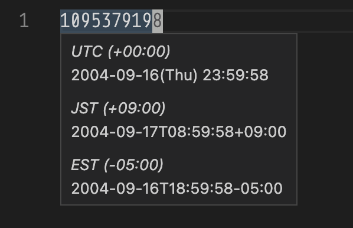

# VS Code Date Preview

## Features

Preview date string while hovering them. You could display one primary preview, and alternative previews as many as you want. For instance, your could display one local time zone and several different time zones.

Now supports:

* [Unix Time](https://en.wikipedia.org/wiki/Unix_time) (10/13 digits)
* [ISO 8601](https://en.wikipedia.org/wiki/ISO_8601)

## Extension Settings

This extension contributes the following settings:

* `date-preview.detect.ISO-8601String`: Whether to detect [ISO-8601](https://en.wikipedia.org/wiki/ISO_8601) format date string.
* `date-preview.detect.unixTime`: Whether to detect Unix Time. Currently supports seconds and millonseconds.
* `date-preview.primaryPreview.enable`: Primary date preview format, described in [day.js format documentation](https://day.js.org/docs/en/display/format). Leave empty to use ISO-8601 format.
* `date-preview.primaryPreview.name`: Show as the name of primary preview section.
* `date-preview.primaryPreview.format`: Primary date preview format, described in [day.js format documentation](https://day.js.org/docs/en/display/format). Leave empty to use ISO-8601 format.
* `date-preview.alternativePreviews`: An array of alternative preview items.
* `date-preview.alternativePreviews[].name`: Show as the name of alternative preview section.
* `date-preview.alternativePreviews[].format`: Used to format preivew display. Leave empty to use ISO-8601 format.
* `date-preview.alternativePreviews[].utcOffset`: UTC offset of custom preview timezone. If the input is between -16 and -16, it will be interpreted as hours, otherwise, minutes instead. Leave empty to use local timezone.

## Known Issues

## Release Notes

### 1.0.0

Initial release

